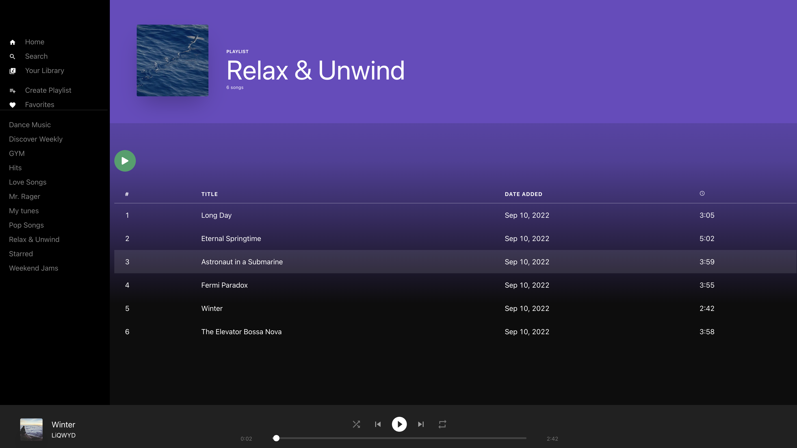

This was a project made off a lesson on FrontEnd Masters, i have made some adjustments to the original code to work with the SupaBase api and added some of my own ideas. This was mainly for educational purposes. 

[]

